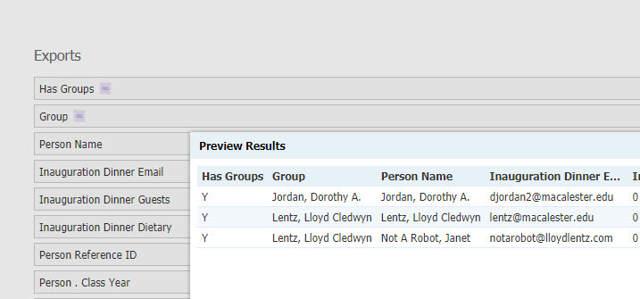
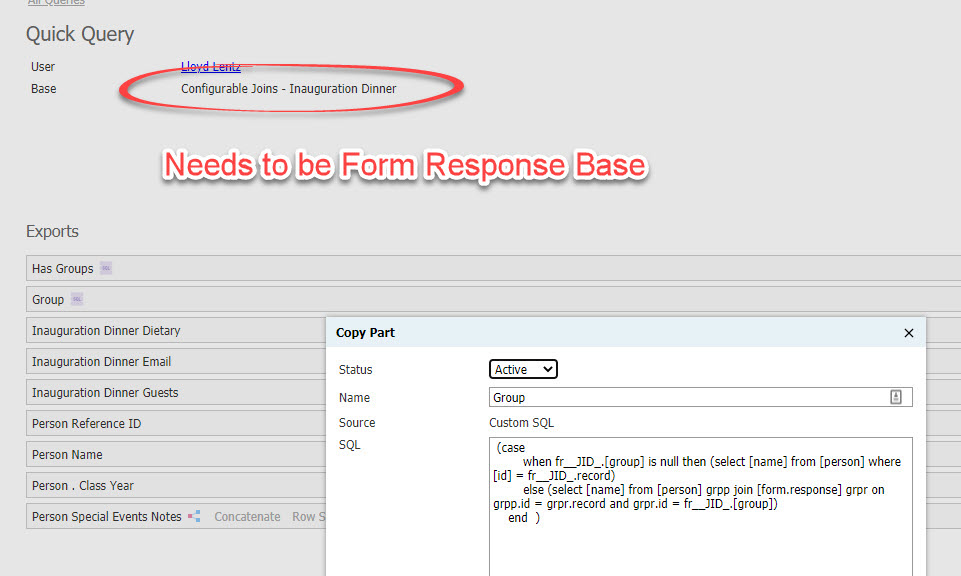
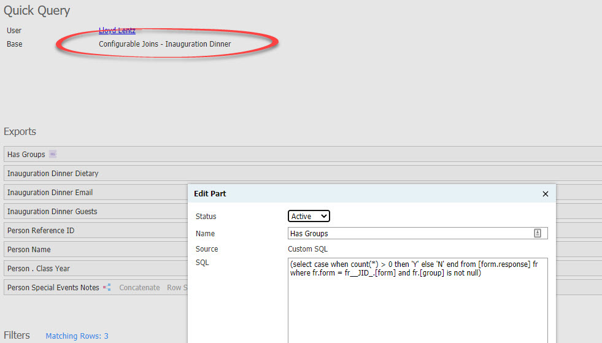

## Show Event Groups in sql

Add a custom SQL :

**[Has Groups]**
```SQL
(select case when count(*) > 0 then 'Y' else 'N' end from [form.response] fr where fr.form = fr__JID_.[form] and fr.[group] is not null)
```

***[Group]***
```SQL
(case 
        when fr__JID_.[group] is null then (select [name] from [person] where [id] = fr__JID_.record) 
        else (select [name] from [person] grpp join [form.response] grpr on grpp.id = grpr.record and grpr.id = fr__JID_.[group])  
    end  )
```

 

 

 


