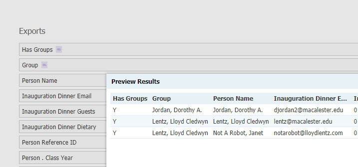
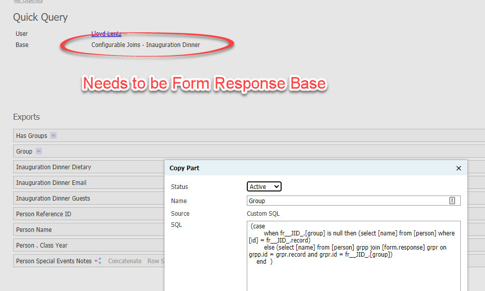
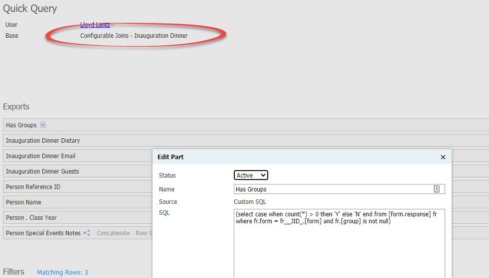

# Show Event Group Registrations in a Query

Two Custom SQL exports for a Form Response based query.

**Has Groups:** does this event have any group registrations?

```sql
(select case when count(*) > 0 then 'Y' else 'N' end
   from [form.response] fr
  where fr.[form] = fr__JID_.[form] and fr.[group] is not null)
```

**Group:** the group leader's name, or the registrant's own name if not in a group.

```sql
(case
   when fr__JID_.[group] is null
     then (select [name] from [person] where [id] = fr__JID_.[record])
   else (select [name] from [person] grpp
           join [form.response] grpr on grpp.[id] = grpr.[record] and grpr.[id] = fr__JID_.[group])
 end)
```







See also: [Show group name on the event summary page](summary_page_group_name.md).
