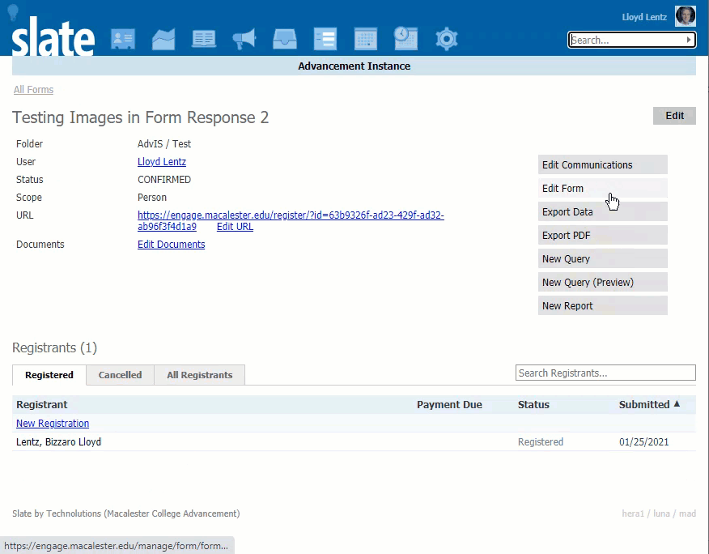

# Photo Uploader (Base64)

Store an uploaded photo directly in a text field as a Base64 data URL.

## Step 1: Form

Add a Text Box with Export Key **photo_data_url**.

## Step 2: Form script

In **Edit Scripts / Styles**, add:

```javascript
//########## Define elements ########
var photoField = form.getElement("photo_data_url");
var fileInput = $("<input type='file' />");
var photoData = $("<br/>");
photoField.after(fileInput);
photoField.after(photoData);
photoField.hide();


if (form.getElement('photo_data_url').val()){
	$('#photodata').attr("src",form.getElement('photo_data_url').val());
}

var encodeImageFileAsURL = function(element) {
   var file = element.files[0];
   var reader = new FileReader();
    reader.onloadend = function() {
     photoField.val(reader.result);
      $("#photodata").attr("src",reader.result);
   }
   reader.readAsDataURL(file);
}


fileInput.bind("change", function(){
	encodeImageFileAsURL(this);
});
```

Give it a whirl. The photo is stored in the field when the form is saved.




## Optional: thumbnail

To also store a thumbnail version, add a field:

 * Export Key: **photo_data_url_thm**
 * Label: **Thumbnail Size**
 * Briefcase: `09fe8c90-e925-d5ce-c99a-6bfb156d9fd2@mad`
 * [Use this script instead](photo_uploader_thumbnail.js)

To shrink large photos before saving, see [photo_uploader_resize.js](photo_uploader_resize.js).

> Base64 photos are large. Many of them can push a portal past Slate's render limit; see [Convert Base64 images](../scripts/convertBase64Images/readme.md).
