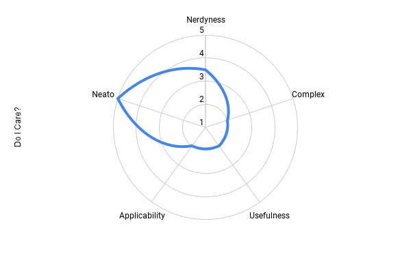
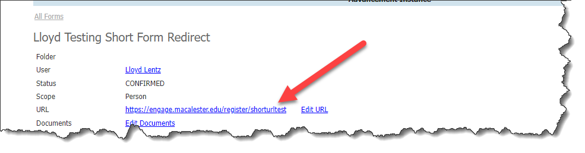

# Custom Short URL for your Slate Instance

Y'know what is kinda fun?   Short links.  Like turning a long URL link into a more readable one

Turn this

https://engage.macalester.edu/register/?id=7c94151a-71b0-40e0-baa8-d804fa28c516&person=4140156b-cf7a-4f23-a69d-68b9f7b69606&howawesome=All%20of%20the%20awesome,%20don%27t%20get%20me%20started.

into this 
https://bit.ly/3G1YaKw.   

or even this https://mclstr.page/shorturltest/0001

Right?   Same result, one is way easier to read.  (And frankly looks more professional in your texting campaigns to your donors or constituents)

I think this is kinda fun, and it was super easy.   Let me show you how you can have short link fame and success as well:

### Standard Caveat

 

### STEP 1 - Choose a domain

There are roughly 13 berjillion hosting providers, I am a [Google Guy](https://gdg.community.dev/gdg-twin-cities/), so let me walk you through this dead simple way.

1. Go to https://domains.google.com
2. Search for something clever and available.   I chose **mclstr.page**.   Get it?   Macalester without vowels.   I know, very [TWTR](https://www.wired.com/2012/06/alt-text-stupid-new-tlds/) of me.  Also, at the time of print, .page domains are like $8/yr
3. When you register your domain go to Website >> Set Up Forwarding
4. In the **Forward To** put `https://YOUR-SLATE-DOMAIN/portal/invite?cmd=invite&invite=`
5. Expand the "Advanced Options"
6. **Redirect Type** = 302
7. **Path Forwarding** = Forward Path  !! THIS IS IMPORTANT !!
8. **SSL On**
9. Click [Forward]

Because of the way the Internet [Tubing](https://knowyourmeme.com/memes/series-of-tubes) works you may have to wait a couple few hours for this to start working.   In the meantime, let's get your Slate portal setup and ready to accept your new awesome shortlinks.

### Step 2 - Redir Portal

1. Make a new portal with they key "invite"... or whatever you want, but if you change it, change the protal name in STEP 1.4 above. Security = Anonymous
2. Make a new query, Name = Invite,  custom SQL, of course, add a paraemter `<param id="invite" />` and drop in this [SQL](invite.sql) 
3. Make a new View, Name = Default.   Put some place holder in there like "hi".
4. Make a new Method, Name = Default.  No action, Default Branding, View = Default
5. Make a new method, Name = Invite, Output Type = Redirect, Action = invite, View = Default.   
6. In the Invite Method, link queries to your Invite Query

### Step 3 - Create your reg form, with custom URL
Make a new form.  Edit Form >> Edit Properties >> Check "Allow Secure Login Link or whatever it says"

Remember, we are trying to shorten things up, so come up with some Custom URL that you like. 

### Test it out

By now you should see be able to go to your domain and see what is happening.

Try going to your YOUR-SITE-URL/portal/invite?cmd=invite&invite=/{{YOUR-SHORT-FORM-PATH}}/{{SOME REF ID}}

### Step 4 - Test your merge

New Query, Config Joins of course, always use Config Joins, Person base
Add a subquery Export.  
1. Type = Concat
2. Add Literal = `https://YOUR-NEW-URL.whatevs/`
3. Add Literal = `YOUR-SHORT-FORM-PATH`
4. Add Literal = `/`
5. Add field = [Person Ref Id]

Run that sucker and try some out!

